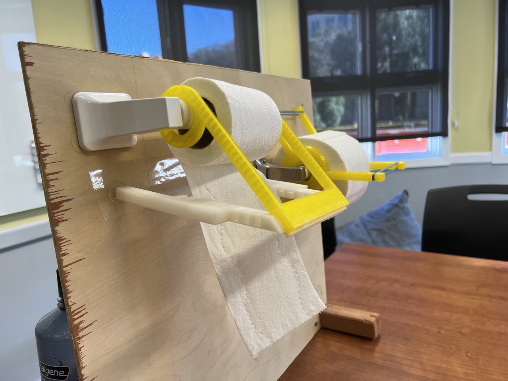
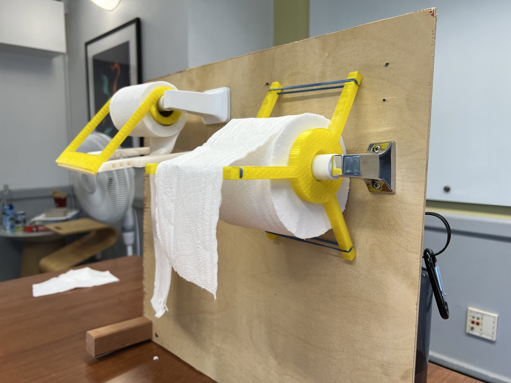

# Introduction
DISCLAMER: This device has not been tested by any person with limited mobility and we thus cannot guarantee that a given person with a disability will benefit from it. We are open to discussing improvements and hearing about experiences with this product. If you are interested, please contact sherylhsu02@gmail.com.

This project was designed as part of the Compassionate Design class at Stanford University. It includes 2 3D printed toilet paper add ons that allow a person with limited mobility (only use of one hand) to be able to independently tear toilet paper and thus use the bathroom.

<iframe width="560" height="315" src="https://www.youtube.com/embed/-dQ2YQPnURs" title="YouTube video player" frameborder="0" allow="accelerometer; autoplay; clipboard-write; encrypted-media; gyroscope; picture-in-picture" allowfullscreen></iframe>

# EzRoll Tear

The idea behind EzRoll Tear is that the user can pull the piece of toilet paper against a blade. EzRoll Tear prints in 6 pieces - the main body, blade, two legs, and two extensions. The legs and extensions slot into each other so that the device can fit any toilet paper holder. This also allows the angle of the device to be adjusted. The blade is 3D printed and very dull (duller than a butter knife).

Once all parts have printed, you should super glue the legs and blade to the main body. [Suction cups](https://www.amazon.com/dp/B08LZRS8NC?ref=ppx_yo2ov_dt_b_product_details&th=1) need to be hot glued to the end of the extensions to hold the device in place. If the suction cups don't stick to your bathroom wall, try placing a piece of packing tape over the wall.
# EzRoll Squeeze

EzRoll Squeeze was inspired by perfect tear paper towel rolls. The idea is to use 3D printed parts connected by elastic bands to create friction and thus allow the user to tear the toilet paper without the toilet paper roll moving. In addition, because of the friction, it is more difficult to roll out toilet paper. For people who struggle to tear the correct amount, this could prevent them from accidentally rolling out too much.

This design is rather simple to print. Simply print two of the files located in the thingiverse (link at top of page) and conenct them via rubber bands. 

# Comparison 

We think that EzRoll Squeeze is cheaper and simpler to build as it is only two 3D printed parts connected by elastic bands. On the other hand, EzRoll Tear is probably easier for users with limited visibility to use as with EzRoll Squeeze the toilet paper could tear and the leftover stay stuck to the roll while with EzRoll Tear the toilet paper is always hanging down. For users who struggle with measuring out the correct amount, the friction provided by EzRoll Squeeze could prevent them from accidentally tearing too much. In the end, you should watch the demo video and see which seems more appropriate for your end user.